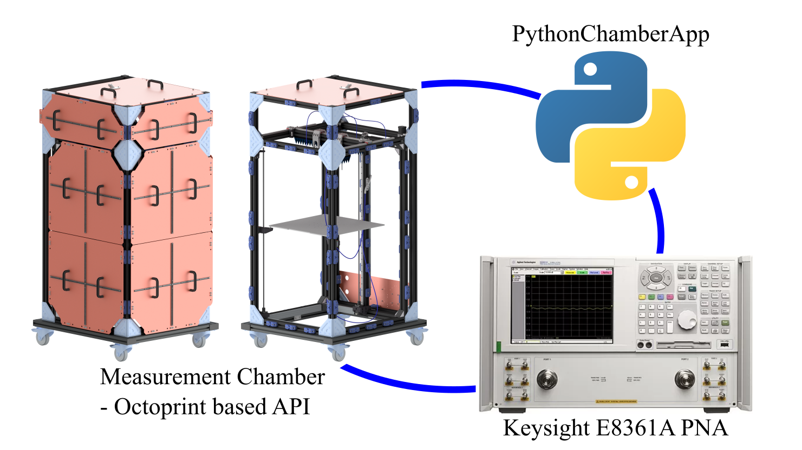

# PythonChamberApp
> Python based app that automates measurement processes for the E3 institute at TUHH.

The app connects to the measurement chamber and a vector network analyzer (VNA) that are located in the same network as the app's host via http protocol.
Given the IP addresses and API-commands of the chamber and the VNA, the app takes inputs about the desired near-field-scan (mesh, boundaries, ..) through an UI
and controls both devices/measurement equipment in an alternating fashion to achieve an automated measurement process for a defined volume.



## Installation

``ToDo``
OS X & Linux:

```sh
npm install my-crazy-module --save
```

Windows:

```sh
edit autoexec.bat
```

## Usage example

``ToDo``
A few motivating and useful examples of how your product can be used. Spice this up with code blocks and potentially more screenshots.

_For more examples and usage, please refer to the [Wiki][wiki]._

## Development setup

``ToDo``
Describe how to install all development dependencies and how to run an automated test-suite of some kind. Potentially do this for multiple platforms.

```sh
make install
npm test
```

## Release History

* 0.0.2
    * ADD: Filestructure!
    * FIX: nothing so far
    * CHANGE: adaptations to readme file with personal data
    * started file structure based on recommendations on [RealPython](https://realpython.com/python-application-layouts/#application-with-internal-packages)
* 0.0.1
    * Initialization with templates for .gitignore file and readme

## Meta

Nils Bade – n.bade@tuhh.de

Distributed under the GPL-3.0 license. See ``LICENSE`` for more information.

[https://github.com/NilsBade](https://github.com/NilsBade)

## Contributing

1. Only desired in cooperation with E3 institute of TUHH

<!-- Markdown link & img dfn's -->
[travis-image]: https://img.shields.io/travis/dbader/node-datadog-metrics/master.svg?style=flat-square
[travis-url]: https://travis-ci.org/dbader/node-datadog-metrics
[wiki]: https://github.com/yourname/yourproject/wiki