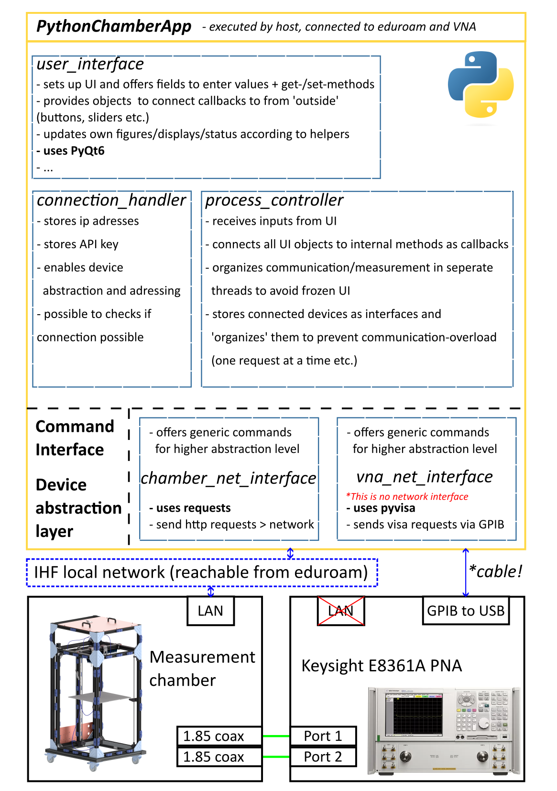

# PythonChamberApp
> Python based app that automates measurement processes for the E3 institute at TUHH.

The app connects to the measurement chamber that is located in the same network as host/controller via http protocol.
Moreover, the app supports to use a GPIB/USB Interface to control a vector network analyzer (VNA) via VISA standard.
Given the IP addresses and API-commands of the chamber and the VNA, the app takes inputs about the desired near-field-scan (mesh, boundaries, ..) through an UI
and controls both devices/measurement equipment in an alternating fashion to achieve an automated measurement process for a defined volume.


## File structure
The app is structured in a modular fashion to achieve extendability and maintainability.
This section gives you an overview of the modules that are defined, what their purposes are and where each file is located.
> [!NOTE]
> The file structure is work in progress and  must be maintained manually!

```
PythonChamberApp/
│
├── .venv/ **[local!]**
│
├── docs/
│   ├── user_interface.md - not done
│   ├── connection_handler.md - not done
│   ├── process_controller.md - not done
│   ├── figure_generator.md - not done
│   ├── chamber_net_interface.md - not done
│   └── vna_net_interface.md - not done
│
├── PythonChamberApp/
│   ├── runner.py (>> starts the app <<)
│   ├── user_interface/
│   │   ├── ui_3d_visualizer.py
│   │   ├── ui_auto_measurement.py
│   │   ├── ui_chamber_control_window.py
│   │   ├── ui_config_window.py
│   │   ├── ui_display_measurement_window.py
│   │   ├── ui_mainwindow.py
│   │   └── ui_vna_control_window.py
│   │
│   ├── connection_handler/
│   │   ├── __init__.py
│   │   └── network_device.py
│   │
│   ├── process_controller/
│   │	├── __init__.py
│   │   ├── AutoMeasurement_Thread.py
│   │   ├── multithread_worker.py
│   │   └── process_controller.py
│   │
│   ├── figure_generator/ (NOT USED)
│   │   └── __init__.py
│   │
│   ├── chamber_net_interface/
│   │	├── __init__.py
│   │   └── chamber_net_interface.py
│   │
│   └── vna_net_interface/
│    	├── __init__.py
│       └── vna_net_interface.py
│
├── data/ (NOT USED)
│   ├── figures?
│   └── logos?
│
├── tests/
│   ├── integration/
│   │   ├── test_chamber_net_interface.py
│   │   └── test_chamber_websocket.py (NOT USED, does not work)
│   │
│   ├── Scripts/
│   │   └── various test scripts for everything...
│   │
│   └── unit/
│       └── test_connection_handler.py (Unit tests for chamber network interface class)
│
├── figures/
│   └── ...
│
├── .gitignore
├── LICENSE
└── README.md
```



## Installation
To run the PythonChamberApp the following steps are necessary:

1. Clone this repository in a desired directory
2. Install Python 3.11.9 if not already available
3. Open the upper/first PythonChamberApp directory of the repository and create a virtual environment there. Set Python 3.11.9 as active interpreter.
4. Make sure to activate your virtual environment from terminal. (Terminal in './PythonChamberApp' directory)
    ```sh
    .\.venv\Scripts\activate
    ```
5. Install necessary modules for UI and network communication in your virtual environment from terminal.

    **PyQt6**
    ```sh
    python -m pip install PyQt6
    ```
   **PyQtGraph**
    ```sh
    python -m pip install pyqtgraph
    ```
   **PyOpenGL**
    ```sh
    python -m pip install PyOpenGL
    ```
   **matplotlib**
    ```sh
    python -m pip install matplotlib
    ```
   **requests**
    ```sh
    python -m pip install requests
    ```
   **numpy**
    ```sh
    python -m pip install numpy
    ```
      **PyVisa**
    ```sh
    python -m pip install pyvisa
    ```
> [!NOTE]
> If you plan to develop new features for the app, also install **pytest** to support unit test functionality
>   ```sh
>   python -m pip install pytest
>   ```
> Installing pytest, make sure that it is installed **in the same virtual environment** the whole app is running in.
> Otherwise pytest will not be able to find the modules imported by the unit-tests but throw a "ModuleNotFoundError".
  
6. Install a visa backend for the [PyVisa Package](https://pyvisa.readthedocs.io/en/latest/index.html), used by the PythonChamberApp.
Dependend on the hardware you want to use you should choose between the [Keysight IO Libraries Suite](https://www.keysight.com/de/de/lib/software-detail/programming-examples/io-libraries-example-programs-2798637.html)
or the [National Instruments Visa](https://www.ni.com/de/support/downloads/drivers/download.ni-visa.html#521671).
Your hardware and software should be from the same company to be sure everything works properly, otherwise pyvisa will
throw errors trying to import the module.

7. Execute the 'runner.py' script in './PythonChamberApp/PythonChamberApp/runner.py' (in your virtual environment).

## Usage example

The PythonChamberApp can be used to probe the near field radiation of an antenna in a 3d volume.
To evaluate e.g. the focus-performance of a newly designed antenna for our medical radar applications, this setup is 
capable of automating the measurement process and provides an easy-to-use interface to analyse the measured data 
afterward. Moreover, being implemented with MatPlotLib, the graphs can be exported easily to be used for documentation 
or similar. 

## Development setup

To further develop the app one should read into the folder structure first and look into the object relations to stick
to the given structure. This improves readability of the whole project as well as extendability for new people 
that take part in the project.

That being said, look into the [SoftwareStructure](#file-structure).
The chamberApp will always be started from the runner script. 
This assures that all paths are configured correctly before importing all modules and subclasses.
From there the ProcessController class is the core and kind of 'backend' of the app.
Throughout the init(), a mainwindow-instance is created (ref ./PythonChamberApp/user_interface/mainwindow.py) which 
itself, again generates all subwindows as objects.

Each subwindow is defined as an own class and owned by the mainwindow.
Everything that can be managed just in the GUI, is implemented as private function in each window-class.
In the properties of each subwindow-class all the interactive GUI-objects are listed to give an overview 
what can be 'used'. These GUI objects are connected to more complex callback functions be the ProcessController 
throughout it's init().

To prevent the app from freezing despite the network communication with other devices, the app uses a threadpool to 
manage requests to other devices. Every request to the chamber via http has its own thread-slot in the 
processController, allowing only one request at a time. Communication with the VNA works the same way.

The AutoMeasurementProcess is implemented as a whole own thread that is run by the app in the background. It organizes
movements and measurements in alternating fashion and sends feedback to the GUI via signals. Always when another thread
(worker) is started, its signals are connected to GUI functions as Slots beforehand, so that update messages from 
threads running in the background appear on the GUI without freezing it.
If you want to develop more functionality that may long computation or file-read-time, please consider to implement 
methods so that they can be processed by a worker-thread in the background and send their results via signals.

The Display Measurement Window is implemented without multithreading eventhough reading files may take time. 
This is a meant design decision to give the user some kind of feedback about the size of data that is read
and to prevent from doing some other stuff in the app, modifying parameters, while properties of the processcontroller
are directly modified by the other thread in the meantime. (see property 'read_in_measurement_data_buffer': dict)

Even though only the chamber interface has its own unittests implemented so far, programming unittests for new classes 
and functions is always a good idea! 
If you want to do it the same way or test the unit-tests of the chamber_net_interface again, you need to install 
the following package: 

```sh
make install
npm test
```

## Hardware Setup
By default, the chamber should already be completely wired to the driver board ([SKRat V1.0](/docs/Datasheets%20RatRig%20Electronics/BTT_SKRat_V1.0_User_Manual.pdf))
and the Raspberry Pi 4. This enables control of all Stepper motors and the limit switches. 
If something was detached and wiring is open, details about the driver-board wiring are given in the [SKRat Wiring-Section](#skrat-wiring) next up.

> [!CAUTION] 
> When you start working with the chamber, the first thing it has to do is **home all axis**. Therefor, the 
> [BL-Touch-Sensor](docs/Datasheets%20RatRig%20Electronics/BLTouch-Datasheet.pdf) with its plate must be **mounted to 
> the Probehead!** Klipper does not differentiate between a not-triggered and a not-wired sensor, which would result in 
> the bed, running into the bearings!

The only part that is meant to be frequently attached and detached from the chamber is the Z-endstop/limit-switch,
 which is the BL-Touch sensor. It can be easily connected and disconnected by clipping the plate to the probehead
(connection is magnetic) and plugging the wiring into the socket located in the top-center above the upper bearing
 of the leadscrew in the back of the chamber.


### SKRat Wiring


## Step-by-Step Guide to Run a Measurement
1. **Start the PythonChamberApp**
    - Run the runner.py script.
    - The main window of the app should appear.
2. **Connect to the Chamber**
    - Enter the IP address of the chamber in the 'Config Window'.
    - Click 'Connect'.
    - The connection status should change to 'Connected' and the send commands and received messages are displayed in the terminal window.
3. **Connect to the VNA**

## Release History

* 0.1.0
  * First Version of App 'released' 17.06.2024
* 0.0.2
    * ADD: Filestructure!
    * FIX: nothing so far
    * CHANGE: adaptations to readme file with personal data
    * started file structure based on recommendations on [RealPython](https://realpython.com/python-application-layouts/#application-with-internal-packages)
* 0.0.1
    * Initialization with templates for .gitignore file and readme

## Meta

Nils Bade – n.bade@tuhh.de

Distributed under the GPL-3.0 license. See ``LICENSE`` for more information.

[https://github.com/NilsBade](https://github.com/NilsBade)

## Contributing

1. Only desired in cooperation with E3 institute of TUHH

<!-- Markdown link & img dfn's -->
[travis-image]: https://img.shields.io/travis/dbader/node-datadog-metrics/master.svg?style=flat-square
[travis-url]: https://travis-ci.org/dbader/node-datadog-metrics
[wiki]: https://github.com/yourname/yourproject/wiki